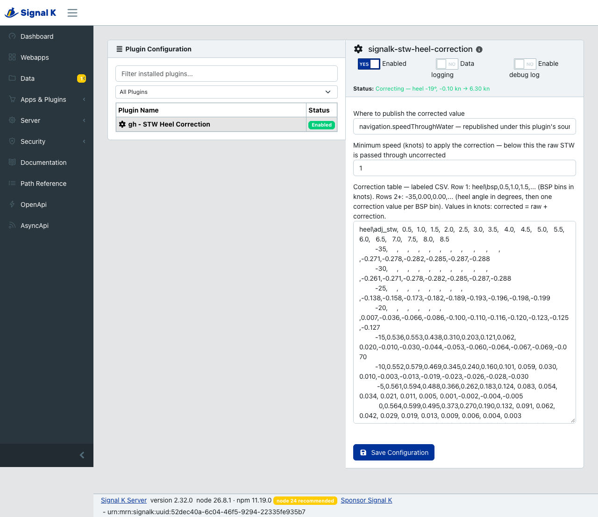

# signalk-stw-heel-correction

Signal K plugin that corrects speed through water for heel angle using a 2D bilinear interpolation table.

Most paddlewheel logs read differently depending on which way the boat is heeled. This plugin removes that error before anything else on the boat sees it: it watches `navigation.speedThroughWater`, looks up a correction for the current heel angle and boat speed in a table you supply, and **republishes the corrected value on the same path under its own `$source`**.

You then rank this plugin above the raw sensor in the server's **Source Priorities**. Every consumer — displays, logbook, autopilot, anything reading `navigation.speedThroughWater` — gets the corrected value with no reconfiguration, while the raw sensor value stays visible in the data model under its own source for comparison and calibration.

Alternatively it can publish to a separate `navigation.speedThroughWaterCorrected` path, leaving the raw value alone — see **Output path** below.



---

## Why heel correction matters

### The paddlewheel is wrong when the boat heels

A paddlewheel or impeller is almost never on the centreline, and even when it is, it tilts with the hull. As the boat heels:

- On one tack the sensor is pushed deeper; on the other it rises toward the surface, where the flow is disturbed and it can ventilate or come clear of the water altogether on a big heel.
- The water no longer meets the paddle square on. It flows across the hull at an angle, and through a boundary layer whose thickness varies around the hull.
- The size of both effects changes with boat speed.

The result is a speed error that depends on heel angle, on which side the boat is heeled to, and on speed. A log calibrated upright on flat water can be accurate motoring and then read noticeably high on one tack and low on the other.

### Why a small STW error causes big problems

Boat speed through the water is not only a number on a display. It is an input to most of the other numbers the instruments calculate:

- **True wind.** True wind speed and angle are worked out from apparent wind and boat speed. A tack-dependent STW error produces a tack-dependent true wind: the true wind direction appears to swing every time you tack, even though the wind has not changed. That makes wind shifts hard to read and laylines unreliable.
- **Performance and polars.** Target speeds, polar percentage and VMG are compared against STW. If the log reads high on port and low on starboard, the boat looks fast on one tack and slow on the other, and any polar built from logged data inherits the error.
- **Tide and current.** Set and drift are the difference between speed through the water and speed over the ground. A 0.3 kn STW error appears directly as 0.3 kn of current that does not exist, and the size of that phantom current changes with every tack.
- **Dead reckoning and leeway**, which rely on the same STW figure.

The problem is at its worst upwind, which is exactly when these numbers are relied on most.

### Why a table, and why do it in Signal K

Many instrument systems either offer no heel correction or offer a single port/starboard factor. That is not enough when the error changes with both heel and speed, which is why this plugin uses a two-dimensional table and interpolates between its entries.

Correcting in Signal K means the correction is applied once, at the source, and everything downstream benefits: displays, the logbook, performance software, true wind calculations and anything else reading `navigation.speedThroughWater`. The raw reading remains available under its own source, so you can compare the two and refine the table over time. If the heel data drops out, the plugin stops publishing and the server falls back to the raw sensor, so you never lose boat speed.

---

## Requirements

- **Node 18 or newer**
- **A Signal K 2.x server with Source Priorities**, for the default output setting. The plugin reads its input with `sourcePolicy: 'all'` and relies on priorities to rank its output above the raw sensor, which depends on the server's recent source-priority rework. The corrected-path output setting does not.
- Source priorities were writable without authentication before server **2.24.0-beta.1** ([CVE-2026-33951](https://advisories.gitlab.com/npm/signalk-server/CVE-2026-33951/)). Since this plugin makes displayed boat speed depend on that setting, upgrade past it before relying on the default output.
- An attitude source publishing `navigation.attitude` roll, in radians, at least once a second.

---

## Installation

Install from the Signal K **App Store**:

1. In the Signal K admin UI, open **Appstore → Available**.
2. Search for **STW Heel Correction** and click **Install**.
3. Restart the server when prompted.
4. Open **Server → Plugin Config**, find **STW Heel Correction**, and enable it. It ships disabled.
5. Choose an output path and set the source priority, both covered below.
6. Replace the example correction table with one measured on your own boat (see **Configuration**).

Updates appear under **Appstore → Updates**.

### Output path

| Setting | What it does |
|---|---|
| **`navigation.speedThroughWater`** (default) | Republishes on the standard path under this plugin's source. Requires a Source Priorities entry (below). Every existing consumer picks it up with no reconfiguration. |
| **`navigation.speedThroughWaterCorrected`** | Publishes to a separate path and leaves the raw value untouched. No priority setup needed, but every consumer must be pointed at the new path by hand. |
| **Both paths** | Publishes to both at once. Useful for comparing raw against corrected on the water before committing to the standard path. |

The corrected path is not in the Signal K schema, so when it is in use the plugin publishes `meta` for it (`units: m/s`) — without that, consumers have no way to know how to display it.

### Required: set the source priority

The plugin publishes under the source `signalk-stw-heel-correction`. **Until you rank it above your paddlewheel source, consumers may still show the raw value.**

In the admin UI: **Server → Source Priorities** → add `navigation.speedThroughWater` → put `signalk-stw-heel-correction` above the instrument source.

This applies to the **standard** and **both** output settings. With the corrected-path-only setting there is no priority to configure.

Priorities also cover the plugin going quiet — if it is disabled, the server restarts, or the heel sensor drops out, consumers fall back to the raw sensor, so STW never goes away entirely.

---

## Development workflow

To run an unreleased version, install straight from GitHub:

```bash
cd ~/.signalk
npm install git+https://github.com/ghotihook/signalk-stw-heel-correction.git#<commit>
sudo systemctl restart signalk
```

Pin the ref: npm will not re-fetch a git dependency whose version has not changed.

For working on the plugin rather than just running it, clone it and install from the working copy so a `git pull` is all the server needs:

```bash
# Server — once
git clone https://github.com/ghotihook/signalk-stw-heel-correction ~/signalk-stw-heel-correction
cd ~/.signalk && npm install ~/signalk-stw-heel-correction

# Mac — after making changes
git add -p && git commit -m "describe change" && git push

# Server — to pick them up
git -C ~/signalk-stw-heel-correction pull && sudo systemctl restart signalk
```

Enable debug logging for the plugin in the Signal K admin UI to see per-update log lines:
```
STW 6.00 kn, heel -10.3° → correction -0.0154 kn → corrected 5.98 kn
```

---

## Tests

```bash
npm test          # node --test
```

Covers table parsing and the paste-damage cases, interpolation and clamping, the output-path settings, both loop guards, the sensor-plausibility rules and the subscribe retry.

---

## Reading the status line

The plugin's status in the admin UI says what it is doing right now, refreshed about once a second:

| Status | Meaning |
|---|---|
| `Waiting for navigation.speedThroughWater` | Subscribed, but no STW has arrived yet. If this stays up, the sensor is not producing. |
| `Correcting — heel 22°, -0.29 kn → 7.11 kn` | Working normally, showing the live heel, the correction being applied and the result |
| `Not correcting — 0.6 kn is below the 1 kn minimum, publishing raw` | Too slow to correct; the raw value is still being published |
| `Not publishing — no heel data, raw source in use` | No usable heel, so the plugin has gone quiet and priorities have fallen back |
| `Not publishing — heel data stale, raw source in use` | Heel data older than 1 s, same behaviour |
| `Not publishing — heel timestamp is ahead of server time, …` | The attitude source's clock disagrees with the server's, so its age cannot be trusted |
| `Not publishing — heel of 172° is not plausible, …` | Heel beyond ±90°. Usually means roll is being published in degrees where Signal K expects radians |
| `Not publishing — raw STW of -5.0 kn is not plausible, …` | A negative or absurd speed from the sensor |
| `Correction table: …` (error) | The table could not be parsed; the message names the offending cell |

---

## Configuration

The plugin ships with a default correction table measured on a 36 ft racer/cruiser, included as a worked example of the format. The correction is specific to a hull and to how the paddlewheel is mounted, so measure your own rather than sailing on the default.

| Setting | Default | Description |
|---|---|---|
| **Output path** | `navigation.speedThroughWater` | Standard path, separate corrected path, or both — see above |
| **Minimum speed (knots)** | `1.0` | Below this raw STW, no correction is applied — `corrected = raw`. Still published, so the plugin does not flap in and out around the threshold. |
| **Correction table** | (built-in example) | Labeled CSV, see below |

---

## Correction table format

A grid of corrections, pasted into the plugin config UI as CSV. The first row gives the boat-speed columns, the first column gives the heel rows, and each cell is the correction for that combination.

```
heel\bsp,0.5,1.0,2.0,3.0    <- label, then boat speeds in knots
    -10,0.12,0.12,0.20,0.20    <- heel in degrees, then one correction per speed
      0,0.55,0.54,0.44,0.28
     10,0.14,0.14,0.22,0.16
```

| Part | Means |
|---|---|
| **First cell** | A label. Write anything — `heel\bsp`, `heel\adj_stw`, `deg\kn`. It is ignored. |
| **First row** | Boat speed in **knots**, one per column |
| **First column** | Heel in **degrees**. Negative is port, positive is starboard |
| **Every other cell** | The correction in **knots**, added to the raw speed |

### The rules

- **Corrections are additive and signed:** `corrected = raw + correction`. A **positive** value means the paddlewheel *under-reads* at that heel and speed, so the correction adds speed back. A negative value means it over-reads.
- **The speed column is chosen from the raw sensor speed**, not from the corrected result — the lookup is done before the correction is applied.
- **Heel is not mirrored.** A table covering only starboard heel does *not* reflect onto port; every negative heel would clamp to the lowest row you gave. Write both halves out, even if they are symmetric.
- **Between grid points the value is interpolated** bilinearly across both axes, so the table can be coarse.
- **Outside the grid the nearest edge is held.** The table does not have to cover every condition, but a too-narrow table applies its edge value flat across everything beyond it.
- **Rows and columns may run in either direction** — smallest first or largest first, independently. A table written the other way up is reversed on load, not rejected.
- **Bins must not repeat.** A duplicated heel angle or speed makes interpolation ambiguous and is rejected.
- **Any grid size works**, down to a single row and column, and the spacing does not have to be even.

### Blank cells

**A blank means "no data here"** — typically a corner of the grid the boat never occupies, like 35° of heel at half a knot:

```
heel\adj_stw,  0.5,  1.0,  1.5,   2.0
         -35,     ,     ,     ,-0.282
         -20,     ,0.007,-0.036,-0.066
           0,0.564,0.599, 0.495, 0.373
```

A blank is **not** read as a zero correction. The nearest known value is extended into it, first along the speed axis and then, for a heel row that is blank all the way across, from the nearest heel row that has data.

Reading blanks as zero would pull a real correction toward nothing as the boat approached the edge of the measured region — in the shipped table, at −25° heel and 4.2 kn, zero-fill gives about −0.055 kn where the measured edge value is −0.138 kn. Holding the edge value is the same behaviour inputs outside the bin range already get.

If you want a genuine zero somewhere, write `0` rather than leaving the cell empty.

### Pasting from a spreadsheet

Copy a range straight out of a spreadsheet and paste it in — the usual transport damage is handled: tab or semicolon separators, CRLF line endings, a UTF-8 byte order mark, quoted cells, alignment padding, blank lines, a trailing separator on every line, a typographic minus sign (`−`) and degree marks on the heel column.

A table that cannot be parsed — a ragged row, a non-numeric entry, no numbers at all — puts the reason in the plugin's error status rather than failing silently.

---

## How it works

The plugin subscribes to `navigation.speedThroughWater` via `app.subscriptionmanager.subscribe` with **`sourcePolicy: 'all'`**, which delivers every sample from every source at full rate with no priority cascade on the input feed. On each value:

1. The value is skipped if it came from this plugin's own `$source` (loop guard), or if it is null or non-finite — **nothing is published**
2. STW is converted from m/s to knots and checked for plausibility (see **Bad sensor data**); an implausible reading is dropped
3. Current `navigation.attitude` roll is read via `getSelfPath` and converted from radians to degrees. If it is missing, non-finite, implausible, more than 1 s old, or dated in the future, the plugin **publishes nothing** for that sample
4. If STW is below the configured minimum speed the correction is forced to zero (`corrected = raw`); otherwise it is bilinearly interpolated from the table at (heel °, BSP kn), with inputs outside the bin range clamped to the nearest edge
5. `corrected = max(0, raw + correction)` — the result is floored at zero
6. The corrected value is published to the configured output path(s) via `app.handleMessage(plugin.id, ...)`, carrying the source delta's timestamp

### Bad sensor data

The plugin refuses to pass on a reading it does not believe, because on the standard path its source is ranked *above* the sensor — republishing a glitch would put this plugin's name on it and hide the raw value underneath.

- Speed through water must be between 0 and 60 kn. Negative or absurd values are dropped, not floored or passed through.
- Heel must be within ±90°. Beyond that the boat is inverted and the table means nothing; in practice this catches roll published in degrees rather than radians.
- Attitude must be no more than 1 s old, and not dated in the future by more than 1 s — a timestamp ahead of the server's means the clocks disagree and the age check proves nothing.
- Null, `NaN` and infinite values are dropped wherever they appear.

In every one of these cases the plugin publishes nothing, which on the standard path means source priorities serve the raw sensor instead.

**When it cannot correct, it goes silent.** Missing STW, missing heel and stale heel all mean the plugin simply stops publishing. The plugin never republishes a value it has not improved. The status line in the admin UI reports which state it is in.

On the standard path that is the whole point — source priorities fall back to the raw sensor, so STW keeps flowing. **On the corrected-path-only setting there is nothing to fall back to**, so `navigation.speedThroughWaterCorrected` simply stops updating and goes stale. Anything consuming it needs to handle that itself.

The one exception is the minimum-speed threshold: below it the plugin still publishes `corrected = raw`. Going silent there would make the plugin drop in and out every time boat speed crossed the threshold, costing a priority fallback timeout on each transition, and the value is identical either way.

### Why this shape

- **`sourcePolicy: 'all'`, not `excludeSelf`.** `excludeSelf` runs a priority cascade on the input feed and delivers a single ranked value. Once this plugin outranks the instrument, that cascade sees the plugin's own (excluded) output as the preferred source that never arrives, and holds the real source as a fallback — stalling input until the fallback timeout. `sourcePolicy: 'all'` bypasses the cascade entirely, which is what a full-rate corrector needs.

- **Subscribe-and-republish, not `registerDeltaInputHandler`.** An input handler is for modifying a delta in place as it passes through, not for republishing a value under your own source. A correction plugin emits under its own `$source` and lets source priority choose between that and the raw source. (This plugin used an input handler until the source-priority rework made the subscribe path viable.)

- **Loop guard** (only relevant when publishing to the standard path). Deltas published with no explicit `source` object get `$source` set to `plugin.id` by the server, and the plugin skips those. As a backstop it also remembers recently published values that differed from their input, and refuses to re-correct one that comes back under an unexpected `$source` — logging the offending source once, since an unbroken loop on the primary STW path is the failure mode that matters most here. If you ever feed an external NMEA source carrying this plugin's corrected value back into Signal K as `navigation.speedThroughWater`, that backstop is what catches it.

---

## Licence

Apache-2.0. See [LICENSE](LICENSE).
